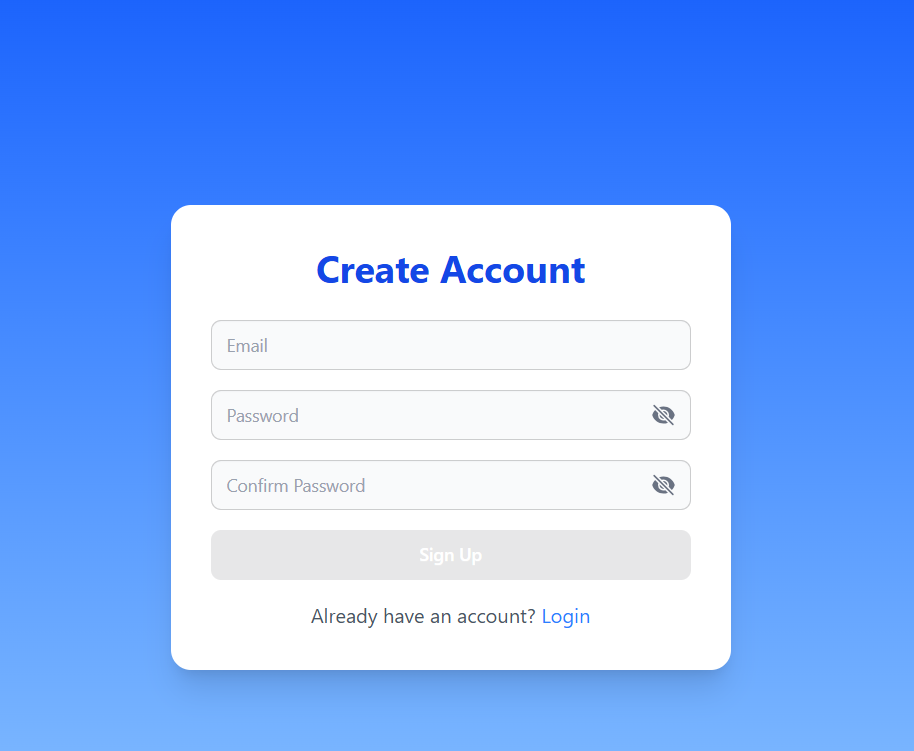
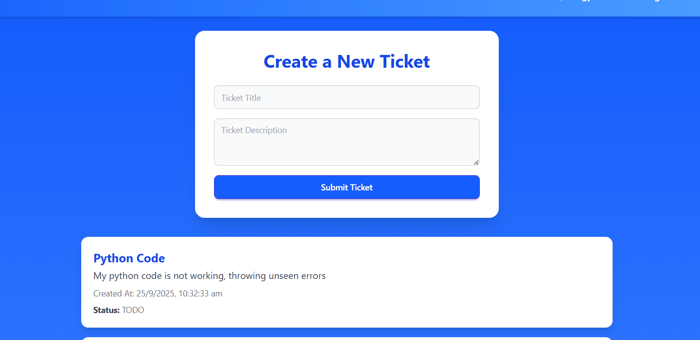
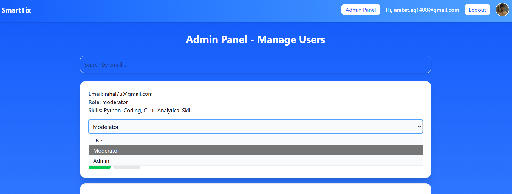
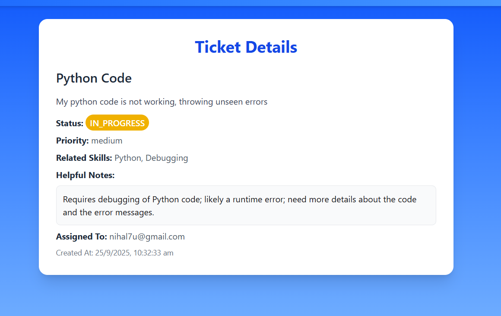

# AI Ticket System


A modern, AI-powered ticket management system built with **React**, **Node.js**, **MongoDB**, and **Inngest**.  
It allows users to create tickets, assign them to moderators, automatically send emails, and provides role-based access control.

---

## Features

### User Features
- Signup / Login with JWT authentication
- Password confirmation during signup
- Toggle password visibility
- Create support tickets with **title** and **description**
- View all tickets created by the user
- Receive **welcome email** upon signup
- Delete their own tickets

### Moderator Features
- View only tickets assigned to them
- Update ticket **status**
- Receive email notifications for assigned tickets
- Cannot delete tickets

### Admin Features
- View all users and tickets
- Update user roles and skills
- Assign tickets to moderators
- Delete any ticket

### UI Features
- Persistent **navbar** with project name and profile card
- Profile card shows GitHub, LinkedIn, Portfolio links
- Smooth animations for profile card opening
- Blurred background when profile card is opened

### Event-driven Architecture
- **Inngest** triggers events:
  - User signup → Sends welcome email
  - Ticket creation → Sends email to assigned moderators

---

## Tech Stack

- **Frontend:** React, Tailwind CSS, React Router
- **Backend:** Node.js, Express.js, MongoDB, Mongoose
- **Email:** Nodemailer with Gmail SMTP
- **Event System:** Inngest
- **Authentication:** JWT
- **Deployment:** Vite

---
## Screenshots

### Login & Signup
| Login | Signup |
|-------|--------|
|  |  |

### Home


### Admin Panel


### Ticket



## Installation

### Prerequisites
- Node.js >= 18
- MongoDB
- Gmail account with App Password
- Inngest account

---

### Backend Setup

1. Clone the repo:

```bash
git clone https://github.com/anixet-14/SmartTix.git
cd SmartTix/Backend
```

2. Install dependencies:

```bash
npm install
```

3. Create a `.env` file with:

```env
PORT=5000
MONGO_URI=<your_mongo_uri>
JWT_SECRET=<your_jwt_secret>

GMAIL_USER=<your_gmail_address>
GMAIL_APP_PASSWORD=<your_gmail_app_password>
```

4. Run Inngest locally:

```bash
npx inngest dev
```

5. Start backend server:

```bash
npm run dev
```

---

### Frontend Setup

1. Navigate to frontend:

```bash
cd ../Frontend
```

2. Install dependencies:

```bash
npm install
```

3. Create `.env` file:

```env
VITE_SERVER_URL=http://localhost:5000
```

4. Start frontend:

```bash
npm run dev
```

---

## Usage

### Signup
- Enter email, password, and confirm password
- Receives welcome email automatically

### Login
- Enter email and password
- Toggle password visibility

### Ticket Management
- **Create Ticket:** Enter title, description, assign moderators
- **Update Status:** Moderators/Admins can change ticket status
- **Delete Ticket:** Users can delete own tickets, Admin can delete any ticket

### Admin Controls
- View all users and tickets
- Update user roles and skills
- Assign tickets to moderators

---

## Notes

- **Emails:** Sent via Gmail. Ensure `GMAIL_USER` and `GMAIL_APP_PASSWORD` are valid.
- **Inngest:** Required locally for event-driven workflows:

```bash
npx inngest dev
```

- **JWT:** Stored in localStorage on login/signup

---

## Contributing

Contributions are welcome! Fork the repo and submit a pull request with improvements.

---

## License

MIT License © 2025 Aniket Gupta

---

**AI Ticket System** – Efficient, automated, and event-driven ticket management.

